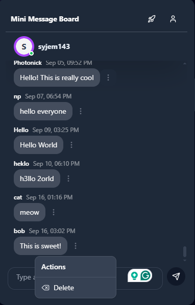

# 📝 Mini Message Board

A simple real-time web-based message board where users can post and view messages — built using **Next.js**, **TypeScript**, **Supabase**, and **Tailwind CSS**.

---

## 🔧 Tech Stack

- **Framework:** [Next.js](https://nextjs.org/) with [TypeScript](https://www.typescriptlang.org/)
- **Database & Auth:** [Supabase](https://supabase.com/) (Postgres + Realtime)
- **Styling:** [Tailwind CSS](https://tailwindcss.com/)

---

## 🚀 Features

- Clean, responsive UI styled with Tailwind CSS
- Real-time message updates powered by Supabase Realtime
- Type-safe development with TypeScript
- Persistent storage with Supabase (Postgres)
- Simple, intuitive interface for messages

---

## 📸 Screenshots

### Message Board


### Admin View



---

## 📦 Installation

1. **Clone the repository:**
   ```bash
   git clone https://github.com/Jem201800538/mini-message-board.git
   cd mini-message-board
   ```
2. **Install dependencies:**
   ```bash
   npm install
   ```
3. **Set up environment variables:**

- Create a .env.local file in the root directory and add your Supabase credentials:

  ```bash
  NEXT_PUBLIC_SUPABASE_URL="https://your-supabase-project-url.supabase.co"
  NEXT_PUBLIC_SUPABASE_ANON_KEY="your-anon-key"
  SUPABASE_SERVICE_ROLE_KEY="your-service-key"
  ```

4. **Run the development server:**

   ```bash
   npm run dev
   ```

## 🌐 Usage

- Open your browser and visit [http://localhost:3000](http://localhost:3000)

## 🛠️ Build for Production

    ```bash
    npm run build
    npm run start
    ```
